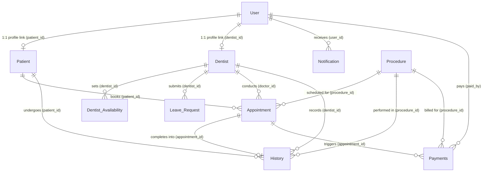

# Toothy Clinic App - Data Dictionary

This document provides a detailed overview of the data architecture for the **Toothy Clinic App**. The database is built on **Supabase** (PostgreSQL) and consumed in the mobile application via client-side models.

---

## 1. Data Dictionary Overview

A production-ready data dictionary does not just catalog column names and SQL types. To build, maintain, and query a database effectively, the data dictionary documents:

1. **Table Metadata**: Table purpose, storage engine, and logical groupings.
2. **Column Details**: Column name, Postgres data type, and the corresponding Dart client-side type.
3. **Key Classifications**: Primary Keys (PK), Foreign Keys (FK), and Unique constraints.
4. **Nullability & Default Values**: Rules on whether data can be empty, and auto-generated defaults (e.g., `NOW()`, UUIDs).
5. **Business Descriptions**: Plain-language explanations of what each field represents in the business domain.
6. **Restricted Values & Enums**: Permitted inputs (e.g., appointment statuses like `Pending`, `Confirmed`, `Completed`).
7. **Relationships & Cardinality**: How entities link together (1:1, 1:N, N:M) and cascading deletion rules.
8. **Row-Level Security (RLS) Policies**: Access control rules governing who can SELECT, INSERT, UPDATE, or DELETE records (critical for Supabase).

---

## 2. Entity-Relationship Diagram

The diagram below maps the relationships and cardinality between tables in the Toothy Clinic database.

---

## 3. Table Catalog

Below is the detailed schema documentation for all 10 tables in the system.

---

### Table: `User`
* **Description**: The core account registry. All registered patients, dentists, and administrators must have a corresponding row in this table.
* **Supabase RLS Policy**: 
  - **Read**: Authenticated users can read their own profile. Admins and Dentists can read all user profiles.
  - **Write**: Users can update their own profile fields (e.g. name, phone). Admins can update roles (`user_type`).

| Column Name | Postgres Type | Dart Model Type | Nullable? | Key / Constraint | Default Value | Business Description & Allowed Values |
| :--- | :--- | :--- | :--- | :--- | :--- | :--- |
| `user_id` | `UUID` | `String` | No | PK | `gen_random_uuid()` | Unique identifier of the user (authenticates with Auth UID). |
| `fullname` | `TEXT` | `String` | Yes | - | - | Full legal name of the user. |
| `email` | `TEXT` | `String` | No | Unique | - | Email address (used for credentials and communication). |
| `user_type` | `TEXT` | `String` | Yes | - | - | Access role. Allowed values: `'patient'`, `'dentist'`, `'admin'`. |
| `created_at` | `TIMESTAMPTZ` | `DateTime` | Yes | - | `NOW()` | Timestamp when the user registered. |
| `date_of_birth`| `DATE` | `DateTime` | Yes | - | - | User's date of birth (used for patient age calculation). |
| `phone` | `BIGINT` | `int` | Yes | - | - | Mobile number (stored as integer without country code prefix). |
| `user_imgUrl` | `TEXT` | `String` | Yes | - | - | URL to profile picture stored in Supabase Storage. |
| `status` | `TEXT` | `String` | Yes | - | `'Active'` | Account status. Allowed values: `'Active'`, `'Deactivated'`. |
| `address` | `TEXT` | `String` | Yes | - | - | Residential or clinic mailing address. |

---

### Table: `Patient`
* **Description**: Extended profile data specific to patients. Contains medical history and emergency contacts.
* **Supabase RLS Policy**:
  - **Read**: Patients can read their own medical records. Dentists and Admins can read all patient records.
  - **Write**: Patients can update their own contact info. Dentists and Admins can edit medical fields.

| Column Name | Postgres Type | Dart Model Type | Nullable? | Key / Constraint | Default Value | Business Description & Allowed Values |
| :--- | :--- | :--- | :--- | :--- | :--- | :--- |
| `patient_id` | `UUID` | `String` | No | PK, FK | - | Foreign Key to `User.user_id` (1:1 relation). |
| `updated_at` | `TIMESTAMPTZ` | `DateTime` | Yes | - | `NOW()` | Timestamp of the last profile modification. |
| `allergies` | `TEXT` | `String` | Yes | - | - | Documented allergies (e.g. `'Penicillin, Latex'`). |
| `medical_conditions`| `TEXT` | `String` | Yes | - | - | Chronical illnesses or medical issues (e.g. `'Hypertension'`). |
| `blood_type` | `TEXT` | `String` | Yes | - | - | Blood group. Allowed: `'A+'`, `'A-'`, `'B+'`, `'B-'`, `'AB+'`, `'AB-'`, `'O+'`, `'O-'`. |
| `emergency_contact_name`| `TEXT`| `String` | Yes | - | - | Full name of emergency contact person. |
| `emergency_contact_phone`| `TEXT`| `String` | Yes | - | - | Phone number of emergency contact person. |

---

### Table: `Dentist`
* **Description**: Extended profile data specific to dentists. Stores clinic details, medical school history, and specializations.
* **Supabase RLS Policy**:
  - **Read**: Public or Authenticated (patients need to view dentist details to book them).
  - **Write**: Admin only can write/edit. Dentists can update minor details (specialization text, status).

| Column Name | Postgres Type | Dart Model Type | Nullable? | Key / Constraint | Default Value | Business Description & Allowed Values |
| :--- | :--- | :--- | :--- | :--- | :--- | :--- |
| `dentist_id` | `UUID` | `String` | No | PK, FK | - | Foreign Key to `User.user_id` (1:1 relation). |
| `updated_at` | `TIMESTAMPTZ` | `DateTime` | Yes | - | `NOW()` | Timestamp of the last profile modification. |
| `specialization`| `TEXT` | `String` | Yes | - | - | Detailed description of specialty area (e.g. `'General Dentistry'`). |
| `clinic_name` | `TEXT` | `String` | Yes | - | - | Clinic site name (e.g., `'BGC Branch'`). |
| `clinic_location`| `TEXT` | `String` | Yes | - | - | Physical clinic address details. |
| `experience` | `TEXT` | `String` | Yes | - | - | Years of active practice (e.g., `'10 years'`). |
| `status` | `TEXT` | `String` | Yes | - | `'Active'` | Professional status. Allowed: `'Active'`, `'On Leave'`, `'Inactive'`. |
| `type` | `TEXT` | `String` | Yes | - | - | Dentist class (used for color coding in UI, e.g. `'Orthodontist'`). |
| `dental_school`| `TEXT` | `String` | Yes | - | - | University/College where dental degree was earned. |
| `graduation_year`| `TEXT` | `String` | Yes | - | - | Calendar year of graduation (e.g., `'2016'`). |

---

### Table: `Procedure`
* **Description**: Catalog of available treatments and services, their durations, and estimated costs.
* **Supabase RLS Policy**:
  - **Read**: Read-only for Patients (public access to fetch catalog).
  - **Write**: Admin and Dentist editable.

| Column Name | Postgres Type | Dart Model Type | Nullable? | Key / Constraint | Default Value | Business Description & Allowed Values |
| :--- | :--- | :--- | :--- | :--- | :--- | :--- |
| `procedure_id` | `UUID` | `String` | Yes | PK | `gen_random_uuid()` | Unique identifier of the procedure. |
| `procedure_name`| `TEXT` | `String` | No | Unique | - | Common name (e.g. `'Teeth Cleaning'`). Prevent duplicates. |
| `procedure_description`| `TEXT`| `String` | Yes | - | - | Explanation of what the dental procedure entails. |
| `category` | `TEXT` | `String` | Yes | - | - | Type classification. Allowed: `'Preventive'`, `'Restorative'`, `'Orthodontic'`, `'Diagnostic'`, `'Cosmetic'`. |
| `pricing` | `INT` | `int` | Yes | - | - | Estimated/Standard cost of the service (in local currency). |
| `timeDuration` | `TEXT` | `String` | Yes | - | - | Standard duration block (e.g., `'30 mins'`, `'120 mins'`). |
| `status` | `TEXT` | `String` | Yes | - | `'Active'` | Catalog state. Allowed: `'Active'`, `'Archived'`. |
| `updated_by` | `UUID` | `String` | No | FK | - | Foreign Key to `User.user_id` tracking who last edited pricing/details. |
| `created_at` | `TIMESTAMPTZ` | `DateTime` | No | - | `NOW()` | Timestamp when procedure was created. |
| `updated_at` | `TIMESTAMPTZ` | `DateTime` | Yes | - | `NOW()` | Timestamp of last modification. |

---

### Table: `Dentist_Availability`
* **Description**: Weekly recurring schedule template representing dentist office hours.
* **Supabase RLS Policy**:
  - **Read**: Read-only for Patients (used to compute bookable slots). Dentist can read own availability.
  - **Write**: Dentist can write/manage own availability slots. Admins can override.

| Column Name | Postgres Type | Dart Model Type | Nullable? | Key / Constraint | Default Value | Business Description & Allowed Values |
| :--- | :--- | :--- | :--- | :--- | :--- | :--- |
| `da_id` | `UUID` | `String` | Yes | PK | `gen_random_uuid()` | Unique identifier of availability entry. |
| `dentist_id` | `UUID` | `String` | No | FK | - | Foreign Key to `Dentist.dentist_id`. |
| `day` | `TEXT` | `String` | No | - | `'Monday'` | Weekday name. Allowed: `'Monday'` to `'Sunday'`. |
| `start_time` | `TIME` | `PostgresTime` | No | - | - | Shift start (e.g. `'08:00:00'`). |
| `end_time` | `TIME` | `PostgresTime` | No | - | - | Shift end (e.g. `'12:00:00'`). |
| `is_avail` | `BOOLEAN` | `bool` | Yes | - | `true` | True if dentist is working, false if blocked out. |
| `updated_at` | `TIMESTAMPTZ` | `DateTime` | Yes | - | `NOW()` | Date of last update. |

---

### Table: `Leave_Request`
* **Description**: One-off blockout requests submitted by dentists for vacations, leaves, or sickness.
* **Supabase RLS Policy**:
  - **Read**: Dentist can read own requests. Admins can read all.
  - **Write**: Dentist can insert requests. Admins can update status (Approve/Reject) and review fields.

| Column Name | Postgres Type | Dart Model Type | Nullable? | Key / Constraint | Default Value | Business Description & Allowed Values |
| :--- | :--- | :--- | :--- | :--- | :--- | :--- |
| `request_id` | `UUID` | `String` | Yes | PK | `gen_random_uuid()` | Unique identifier of the leave request. |
| `dentist_id` | `UUID` | `String` | No | FK | - | Foreign Key to `Dentist.dentist_id`. |
| `start_date` | `DATE` | `DateTime` | No | - | - | Start date of vacation block (inclusive). |
| `end_date` | `DATE` | `DateTime` | No | - | - | End date of vacation block (inclusive). |
| `reason` | `TEXT` | `String` | Yes | - | - | Written reason for absence (e.g., `'Medical Conference'`). |
| `status` | `TEXT` | `String` | No | - | `'Pending'` | Approval status. Allowed: `'Pending'`, `'Approved'`, `'Rejected'`. |
| `reviewed_by` | `UUID` | `String` | Yes | FK | - | Foreign Key to `User.user_id` (must be Admin user) who processed it. |
| `created_at` | `TIMESTAMPTZ` | `DateTime` | Yes | - | `NOW()` | Date request was submitted. |
| `updated_at` | `TIMESTAMPTZ` | `DateTime` | Yes | - | `NOW()` | Date request was last modified. |

---

### Table: `Appointment`
* **Description**: Scheduled sessions connecting a patient, a dentist, and a specific treatment procedure.
* **Supabase RLS Policy**:
  - **Read**: Patients can view their own appointments. Dentists and Admins can view all.
  - **Write**: Patients can insert (create bookings). Dentists and Admins can update status.

| Column Name | Postgres Type | Dart Model Type | Nullable? | Key / Constraint | Default Value | Business Description & Allowed Values |
| :--- | :--- | :--- | :--- | :--- | :--- | :--- |
| `appointment_id`| `UUID`| `String` | Yes | PK | `gen_random_uuid()` | Unique identifier of the booking. |
| `patient_id` | `UUID` | `String` | Yes | FK | - | Foreign Key to `Patient.patient_id`. |
| `doctor_id` | `UUID` | `String` | Yes | FK | - | Foreign Key to `Dentist.dentist_id`. |
| `procedure_id` | `UUID` | `String` | Yes | FK | - | Foreign Key to `Procedure.procedure_id`. |
| `appointment_date`| `DATE`| `DateTime` | No | - | - | Calendar date of treatment. |
| `appointment_time`| `TIME`| `PostgresTime` | No | - | - | Exact time block (e.g., `'09:00:00'`). |
| `status` | `TEXT` | `String` | Yes | - | `'Pending'` | Status. Allowed: `'Pending'`, `'Confirmed'`, `'Completed'`, `'Cancelled'`. |
| `notes` | `TEXT` | `String` | Yes | - | - | Optional patient symptoms or preparation comments. |
| `updated_by` | `UUID` | `String` | Yes | FK | - | Foreign Key to `User.user_id` tracking who made last schedule updates. |
| `created_at` | `TIMESTAMPTZ` | `DateTime` | No | - | `NOW()` | Timestamp when the booking was requested. |
| `updated_at` | `TIMESTAMPTZ` | `DateTime` | Yes | - | `NOW()` | Timestamp when the booking details were last updated. |

---

### Table: `History`
* **Description**: Medical chart entries cataloging procedures completed. Acts as a permanent patient record.
* **Supabase RLS Policy**:
  - **Read**: Patients can read their own history. Dentists and Admins can read all.
  - **Write**: Dentists only can write/insert. No editing (to maintain auditing integrity).

| Column Name | Postgres Type | Dart Model Type | Nullable? | Key / Constraint | Default Value | Business Description & Allowed Values |
| :--- | :--- | :--- | :--- | :--- | :--- | :--- |
| `history_id` | `UUID` | `String` | Yes | PK | `gen_random_uuid()` | Unique identifier of the history record. |
| `patient_id` | `UUID` | `String` | Yes | FK | - | Foreign Key to `Patient.patient_id`. |
| `dentist_id` | `UUID` | `String` | Yes | FK | - | Foreign Key to `Dentist.dentist_id`. |
| `appointment_id`| `UUID`| `String` | Yes | FK | - | Foreign Key to `Appointment.appointment_id`. |
| `procedure_id` | `UUID` | `String` | Yes | FK | - | Foreign Key to `Procedure.procedure_id` for direct treatment reference. |
| `remarks` | `TEXT` | `String` | Yes | - | - | Treatment notes, recommendations, and next steps (e.g., `'Advised flossing daily'`). |
| `created_at` | `TIMESTAMPTZ` | `DateTime` | Yes | - | `NOW()` | Timestamp of treatment entry. |

---

### Table: `Payments`
* **Description**: Financial ledger tracking billing, payment status, and income trends.
* **Supabase RLS Policy**:
  - **Read**: Patients can view their own billing history. Admins can view all payments.
  - **Write**: Admin only can record payments or update status.

| Column Name | Postgres Type | Dart Model Type | Nullable? | Key / Constraint | Default Value | Business Description & Allowed Values |
| :--- | :--- | :--- | :--- | :--- | :--- | :--- |
| `id` | `UUID` | `String` | Yes | PK | `gen_random_uuid()` | Unique transaction ID. |
| `amount` | `INT` | `int` | Yes | - | - | Price charged/billed (copied from Procedure pricing or custom rate). |
| `status` | `TEXT` | `String` | Yes | - | `'Unpaid'` | Transaction status. Allowed: `'Paid'`, `'Unpaid'`, `'Refunded'`. |
| `created_at` | `TIMESTAMPTZ` | `DateTime` | Yes | - | `NOW()` | Timestamp of transaction initiation. |
| `paid_for` | `TEXT` | `String` | Yes | - | - | General descriptor string (e.g., `'Root Canal Treatment'`). |
| `paid_by` | `UUID` | `String` | Yes | FK | - | Foreign Key to `User.user_id` (the patient who pays). |
| `appointment_id`| `UUID`| `String` | Yes | FK | - | Foreign Key to `Appointment.appointment_id` (triggers billing). |
| `procedure_id` | `UUID` | `String` | Yes | FK | - | Foreign Key to `Procedure.procedure_id` (indicates which catalog item). |

---

### Table: `Notification`
* **Description**: Store of in-app notifications generated for booking updates, leave approvals, and clinic announcements.
* **Supabase RLS Policy**:
  - **Read**: Users can read notifications directed to their own `user_id`.
  - **Write**: System-level trigger or Admin-initiated inserts only.

| Column Name | Postgres Type | Dart Model Type | Nullable? | Key / Constraint | Default Value | Business Description & Allowed Values |
| :--- | :--- | :--- | :--- | :--- | :--- | :--- |
| `notification_id`| `UUID`| `String` | Yes | PK | `gen_random_uuid()` | Unique notification ID. |
| `user_id` | `UUID` | `String` | No | FK | - | Foreign Key to `User.user_id` specifying recipient. |
| `title` | `TEXT` | `String` | No | - | - | Headline text (e.g., `'Booking Confirmed'`). |
| `body` | `TEXT` | `String` | No | - | - | Full body description/message. |
| `type` | `TEXT` | `String` | No | - | `'general'` | Notification type. Allowed: `'booking_confirmed'`, `'appointment_reminder'`, `'status_change'`, `'leave_approved'`, `'leave_rejected'`, `'general'`. |
| `reference_id` | `UUID` | `String` | Yes | - | - | Reference to matching entity ID (e.g., specific `appointment_id` or `request_id`). |
| `is_read` | `BOOLEAN` | `bool` | Yes | - | `false` | Read tracking flag. |
| `created_at` | `TIMESTAMPTZ` | `DateTime` | Yes | - | `NOW()` | Timestamp when alert was sent. |

---

## 4. Key Cross-References & Foreign Keys

To ensure database integrity, referential constraints are applied across multiple tables:

1. **User Profile Mapping**:
   - `Patient.patient_id` must match `User.user_id`. Deleting a User profile triggers a cascade deletion of their Patient sub-profile.
   - `Dentist.dentist_id` must match `User.user_id`. Deleting a User profile cascades to their Dentist sub-profile.

2. **Dentist Schedule Constraints**:
   - `Dentist_Availability.dentist_id` must point to an active record in `Dentist.dentist_id`.
   - `Leave_Request.dentist_id` must point to an active record in `Dentist.dentist_id`.
   - `Leave_Request.reviewed_by` must point to a valid record in `User.user_id` where `User.user_type` is `'admin'`.

3. **Booking & History References**:
   - `Appointment.patient_id` points to `Patient.patient_id`.
   - `Appointment.doctor_id` points to `Dentist.dentist_id`.
   - `Appointment.procedure_id` points to `Procedure.procedure_id`.
   - `History.patient_id` points to `Patient.patient_id`.
   - `History.dentist_id` points to `Dentist.dentist_id`.
   - `History.appointment_id` points to `Appointment.appointment_id`.
   - `History.procedure_id` points to `Procedure.procedure_id`.

4. **Payments Linkages**:
   - `Payments.paid_by` points to `User.user_id`.
   - `Payments.appointment_id` points to `Appointment.appointment_id`.
   - `Payments.procedure_id` points to `Procedure.procedure_id`.

---

## 5. System Business Rules & Constraints

In addition to standard foreign key references, the application backend enforces the following business logic constraints:

* **Double-Booking Prevention**: When adding a new row to `Appointment`, a backend constraint prevents inserting if another `Appointment` exists with the same `doctor_id`, `appointment_date`, and `appointment_time` unless its status is `'Cancelled'`.
* **Leave Conflict Override**: Upon Admin approval of a `Leave_Request` (status transition to `'Approved'`), any `Appointment` booked with that dentist (`doctor_id`) falling between `start_date` and `end_date` must have its status set to `'Pending'` or `'Cancelled'`, triggering automated `Notification` alerts to the affected patients.
* **Pricing Read-Only Policy**: Patients can only query `Procedure.pricing` and are prevented from executing `INSERT`/`UPDATE` operations on the catalog.
* **Notifications Trigger**: Inserting an appointment with `status = 'Pending'` or `status = 'Confirmed'` automatically fires an asynchronous trigger that writes a new row to the `Notification` table for the patient and doctor.
