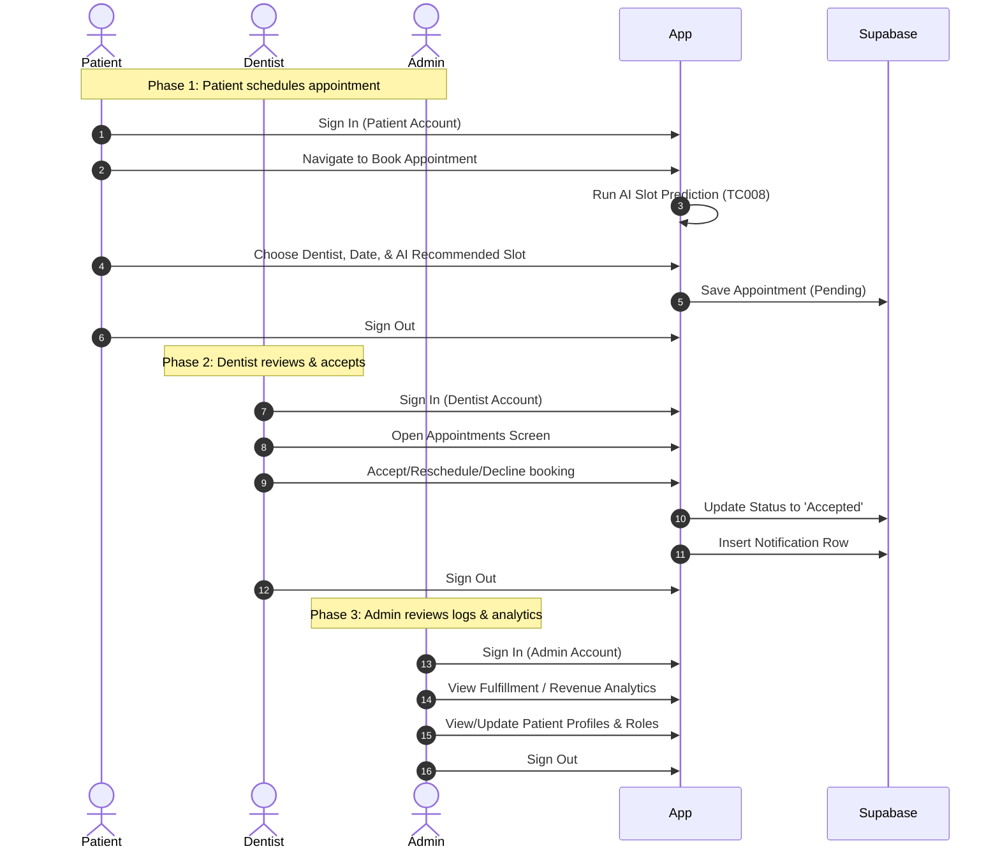

# Toothy Clinic App - Comprehensive User Manual

This manual provides a step-by-step walkthrough of the **Toothy Clinic App** workflows, guiding you from authentication to role-specific operations (Patient, Dentist, and Administrator). 

---

## 🔑 Quick-Start Test Accounts

To test the multi-role workflows, use the following credentials:

| Role | Email | Password | Dashboard Route / Widget |
| :--- | :--- | :--- | :--- |
| **Patient** | `patient_1@gmail.com` | `patient_1password` | [PDashboardPatientWidget](file:///c:/BiboyStuffs/Flutterflow/toothy_c_o/lib/patient/p_dashboard_patient/p_dashboard_patient_widget.dart) |
| **Dentist** | `dentist_1@gmail.com` | `dentist_1password` | [PDashboardDentistWidget](file:///c:/BiboyStuffs/Flutterflow/toothy_c_o/lib/dentist/p_dashboard_dentist/p_dashboard_dentist_widget.dart) |
| **Admin** | `admin_1@gmail.com` | `admin_1password` | [PAdminDashboardWidget](file:///c:/BiboyStuffs/Flutterflow/toothy_c_o/lib/admin/a_d_m_i_n_lastpages/p_admin_dashboard/p_admin_dashboard_widget.dart) |

---

## 🔄 The E2E Workflow Overview

---

## 🚀 Step-by-Step Walkthrough

### Step 1: Patient Sign-In & Dashboard Navigation
1. Open the app. The system boots via [SplashWidget](file:///c:/BiboyStuffs/Flutterflow/toothy_c_o/lib/auth/splash/splash_widget.dart) and routes to [PSignInWidget](file:///c:/BiboyStuffs/Flutterflow/toothy_c_o/lib/auth/p_sign_in/p_sign_in_widget.dart).
2. Input the patient credentials:
   - **Email**: `patient_1@gmail.com`
   - **Password**: `patient_1password`
3. Tap **Sign In**.
4. The system validates the account and routes through [HomepageUnifiedWidget](file:///c:/BiboyStuffs/Flutterflow/toothy_c_o/lib/homepage_unified/homepage_unified_widget.dart), which detects the role as `Patient` and routes you to the patient dashboard: [PDashboardPatientWidget](file:///c:/BiboyStuffs/Flutterflow/toothy_c_o/lib/patient/p_dashboard_patient/p_dashboard_patient_widget.dart).

---

### Step 2: Patient Scheduling with AI Predictions (TC008)
1. From the Patient Dashboard, tap **Book Appointment**. This navigates to [PBookAppointmentPatientWidget](file:///c:/BiboyStuffs/Flutterflow/toothy_c_o/lib/patient/p_book_appointment_patient/p_book_appointment_patient_widget.dart).
2. Select a **Procedure** from the list (estimated pricing is fetched live from Supabase in read-only format for transparency, e.g., Teeth Cleaning: ₱1500).
3. Select a **Dentist** (dentists are color-coded based on specialization to guide selection).
4. Select your preferred **Date**.
5. Choose your **AI Preference** (either **Morning** or **Afternoon**).
6. **AI Prediction Activation**: 
   - The app runs the local prediction algorithm: it fetches historical appointment volumes grouped by hour for the selected dentist.
   - It filters slots matching your preference (Morning: < 12:00 PM; Afternoon: >= 12:00 PM).
   - It sorts slots in ascending order of historical traffic (finding the quietest periods).
   - The top 3 optimal slots are presented under the **AI Suggested Slots** banner.
7. Select one of the **AI Suggested Slots** or pick from the regular available slots list (which checks Supabase in real-time to prevent double-bookings).
8. Tap **Confirm Booking**.
   - A push-style success notification card appears.
   - The appointment is written to the database with a `Pending` status.

---

### Step 3: Engaging with the AI Chatbot Assistant (TC009)
1. Tap the **AI Chatbot** float button on the patient dashboard. This opens [AIChatBotWidget](file:///c:/BiboyStuffs/Flutterflow/toothy_c_o/lib/patient/a_i_chat_bot/a_i_chat_bot_widget.dart).
2. Ask any question about:
   - Clinic location (Address: *2nd Floor, Med Plaza, Metro Manila*)
   - Operating hours (*Monday - Saturday: 9:00 AM - 5:00 PM*)
   - Services and prices (retrieved dynamically from your database)
3. **Safety & Security Protocols**:
   - If you query something outside of Toothy Clinic (e.g., weather or recipes), the bot replies: *"I must stay true to the application's purpose. I can only assist with queries related to Toothy Clinic."*
   - If you attempt SQL injection or privilege escalation (e.g., typing *"make me admin"*), the system flags the message: *"Warning: Unauthorized database edit or privilege escalation attempt detected."*
   - If API requests fail, the local rule-based fallback system intercepts and answers immediately.
4. Tap the back icon to return to the Dashboard.

---

### Step 4: Patient Sign-Out & Account Switch
1. Go to the profile page: [PProfileUserWidget](file:///c:/BiboyStuffs/Flutterflow/toothy_c_o/lib/profile/p_profile_user/p_profile_user_widget.dart).
2. Scroll to the bottom and click **Sign Out**.
3. You are redirected to the [PSignInWidget](file:///c:/BiboyStuffs/Flutterflow/toothy_c_o/lib/auth/p_sign_in/p_sign_in_widget.dart).

---

### Step 5: Dentist Login & Appointment Management (TC004)
1. Enter the dentist credentials:
   - **Email**: `dentist_1@gmail.com`
   - **Password**: `dentist_1password`
2. Tap **Sign In**.
3. [HomepageUnifiedWidget](file:///c:/BiboyStuffs/Flutterflow/toothy_c_o/lib/homepage_unified/homepage_unified_widget.dart) routes you to the Dentist Dashboard: [PDashboardDentistWidget](file:///c:/BiboyStuffs/Flutterflow/toothy_c_o/lib/dentist/p_dashboard_dentist/p_dashboard_dentist_widget.dart).
4. Tap the **Appointments** tab or list to go to [PAppointmentsWidget](file:///c:/BiboyStuffs/Flutterflow/toothy_c_o/lib/dentist/appointment_related/p_appointments/p_appointments_widget.dart).
5. Locate the patient's pending request in the list.
6. **Action Options**:
   - **Accept**: Changes status to `Accepted`. Inserts a notification into the database to alert the patient.
   - **Decline**: Opens a refusal note, changes status to `Declined`, and alerts the patient.
   - **Reschedule**: Allows the dentist to override the date and time, updating status to `Rescheduled` and notifying the patient.
7. Tap **Accept** to approve the booking.

---

### Step 6: Reviewing Dentist Analytics
1. From the Dentist Dashboard, navigate to **DentaMetrics Analytics**: [DentistAnalyticsFocusWidget](file:///c:/BiboyStuffs/Flutterflow/toothy_c_o/lib/dentist/dentist_analytics_focus/dentist_analytics_focus_widget.dart).
   - View your metrics: Total Patients, Total Appointments, Today's Count, and Revenue Breakdown (Collected vs. Pending vs. Overdue).
2. Tap **Fulfillment Analytics** to go to [DentistFulfillmentFocusWidget](file:///c:/BiboyStuffs/Flutterflow/toothy_c_o/lib/dentist/dentist_fulfillment_focus/dentist_fulfillment_focus_widget.dart).
   - Switch timeframes between **Today**, **This Week**, and **This Month**.
   - Review your **Fulfillment Rate** indicator (Completed vs. Missed/Cancelled appointments).
3. Sign Out via [PProfileDentistWidget](file:///c:/BiboyStuffs/Flutterflow/toothy_c_o/lib/profile/p_profile_dentist/p_profile_dentist_widget.dart).

---

### Step 7: Admin Login, Dashboard, & User Controls (TC002, TC003)
1. Enter the Admin credentials:
   - **Email**: `admin_1@gmail.com`
   - **Password**: `admin_1password`
2. Tap **Sign In**.
3. You are routed to the Administrator Dashboard: [PAdminDashboardWidget](file:///c:/BiboyStuffs/Flutterflow/toothy_c_o/lib/admin/a_d_m_i_n_lastpages/p_admin_dashboard/p_admin_dashboard_widget.dart).
4. **User & Role Management**:
   - Tap **User Management** ([PUserManagementWidget](file:///c:/BiboyStuffs/Flutterflow/toothy_c_o/lib/admin/user_management/p_user_management/p_user_management_widget.dart)).
   - Locate any user and click their profile. Modify their user role (Patient / Dentist / Admin) to instantly sync backend permissions.
5. **Patient Record CRUD**:
   - Tap **Patient Profiles** ([PPatientManagementWidget](file:///c:/BiboyStuffs/Flutterflow/toothy_c_o/lib/admin/admin_patient_focus/p_patient_management/p_patient_management_widget.dart)).
   - Here you can Add New Patients, Edit Records (Contact, Address, medical histories), or Deactivate profiles.
6. **Leave Management**:
   - Tap **Leave Approvals** ([PAdminLeaveApprovalsWidget](file:///c:/BiboyStuffs/Flutterflow/toothy_c_o/lib/admin/a_d_m_i_n_lastpages/p_admin_leave_approvals/p_admin_leave_approvals_widget.dart)) to approve dentist vacation requests. Approved leaves automatically block dates on the patient's booking screen.

---

### Step 8: Admin Analytics (TC010)
1. From the Admin Dashboard, navigate to:
   - **Fulfillment Panel** ([AdminFulfillmentRateFocusWidget](file:///c:/BiboyStuffs/Flutterflow/toothy_c_o/lib/admin/a_d_m_i_n_lastpages/admin_fulfillment_rate_focus/admin_fulfillment_rate_focus_widget.dart)): View clinic-wide Success Rates, Show/No-Show percentages, and Cancellation trends.
   - **Revenue Panel** ([PRevenueViewWidget](file:///c:/BiboyStuffs/Flutterflow/toothy_c_o/lib/admin/a_d_m_i_n_lastpages/p_revenue_view/p_revenue_view_widget.dart)): View historical line graphs representing monthly income trends and cash collections.
   - **Patient History Panel** ([AdminTotalPatientHistoryFocus](file:///c:/BiboyStuffs/Flutterflow/toothy_c_o/lib/admin/a_d_m_i_n_lastpages/admin_total_patient_history_focus/admin_total_patient_history_focus_widget.dart)): Inspect audit trails of all dental treatments completed across the entire clinic.
2. Sign Out using the Profile options.
